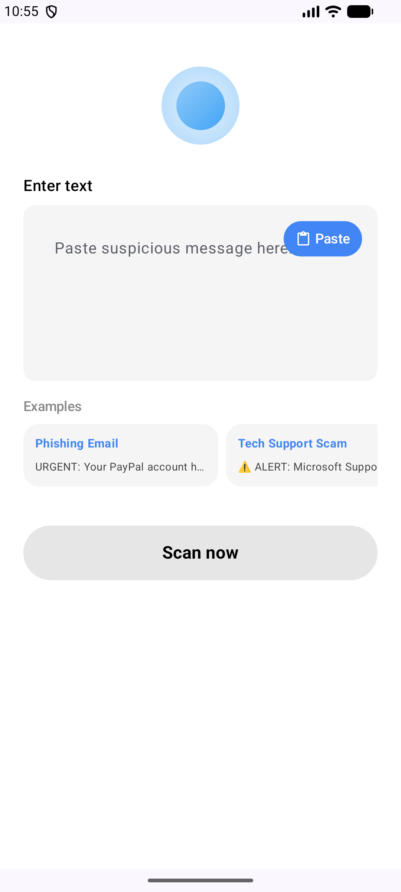
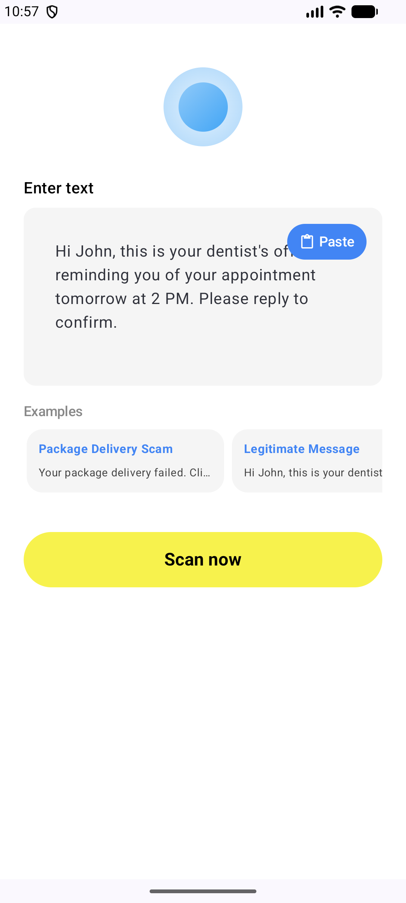
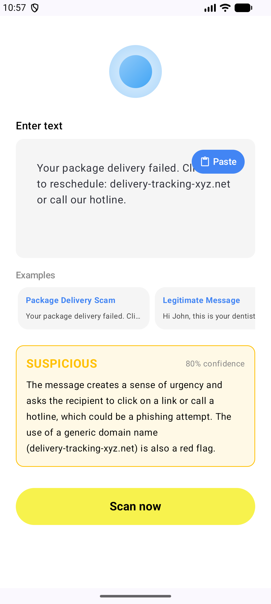

# Scam Message Detector Prototype (Norton AI-First Assignment)

### Project Overview
I chose **Option B: Scam Message Detector**. 
This app helps users identify scam messages (SMS, Email, or URLs). It uses the **Groq LLM API** to provide a risk level (Safe, Suspicious, or Dangerous), a confidence score, and a detailed explanation.

---

### Setup Instructions
1.  **Clone** this repository.
2.  Open the project in **Android Studio** (Koala or later).
3.  Add your Groq API key to the `local.properties` file in the root folder:
    `GROQ_API_KEY=your_key_here`
4.  **Sync Gradle** and run the app on an Android device or emulator (API 26+).
5.  To run tests: Open the terminal and type `./gradlew test`.

---

### Screenshots
  

---

### AI Interaction Log

**1. Prompt: "create a compose screen for scam detection inspired by norton genie. use a big yellow 'Scan now' button at the bottom and a gray card for input. add a blue paste button in the top right of the input area. make it look clean with material 3"**
*   **Commentary:** Instead of building the UI manually, I described the visual hierarchy and brand-specific elements (Genie style). The AI generated the structure directly in the file, which I then refined.

**2. Prompt: "connect this to groq api. generate the data classes and a hilt-compatible analyzer implementation. i need a system prompt that forces the llm to return ONLY json with riskLevel, confidenceScore, and explanation fields. keep temperature low for consistency."**
*   **Commentary:** I used the AI to handle the boilerplate of networking. The key here was "forcing" the JSON output via the system prompt to ensure the app could parse the AI response without errors.

**3. Prompt: "add a LazyRow with scam examples like phishing and fake delivery above the scan button. tapping an example should update the messageInput state in the viewmodel. use realistic scam messages for the mock data so i can test it"**
*   **Commentary:** I delegated the data generation and list implementation to the AI. It quickly provided both the UI code and a set of diverse scam messages for testing.

**4. Prompt: "write unit tests for ScamDetectorViewModel using mockito. verify that analyzing a message updates the ui state correctly on success. use StandardTestDispatcher and advanceUntilIdle to handle the coroutine execution since we have delays"**
*   **Commentary:** Testing coroutines can be tricky. I explicitly told the AI to use `StandardTestDispatcher` and `advanceUntilIdle`, demonstrating that I control the testing strategy while the AI writes the implementation.

**5. Prompt: "add a 2000 char limit to the input in the viewmodel. also make the result area scrollable using verticalScroll so long explanations dont overflow. optimize the ui state class with @Immutable to avoid unnecessary recompositions"**
*   **Commentary:** This prompt shows architectural guidance. I identified specific production-level issues (token limits, UX overflow, and Compose performance) and directed the AI to apply best-practice solutions.

---

### AI Code Review Summary
I used the AI to review my code. Based on the feedback:
*   **Security:** Moved API Key to `local.properties` + `BuildConfig`.
*   **L10n:** Moved hardcoded strings to `res/values/strings.xml`.
*   **Reliability:** Set `readTimeout` to 60s in Retrofit to handle slow AI response times.
*   **Stability:** Added `@Immutable` to `ScamDetectorUiState` to skip unnecessary UI recompositions.
*   **UX:** Added a `verticalScroll` and `derivedStateOf` logic to handle long explanations.

---

### Norton 360 Observations

After exploring Norton Genie, I noticed:
- It uses a conversational UI — user pastes text and gets instant feedback
- Results are color-coded: green/yellow/red for risk levels (I followed the same pattern)
- Genie explains *why* something is suspicious, not just flags it — I replicated
  this with the "explanation" field in my ScamAnalysisResult
- The app feels instant — I added 60s timeout to handle slower LLM responses gracefully

What I would improve in Norton Genie:
- Offline mode with basic regex detection for obvious scams
- History of previously scanned messages

---

### Reflection
What I learned:
*   AI is great for speed, but you need to be very specific about data formats (like JSON) and architecture.
*   Human review is mandatory for "mobile-specific" issues like scroll behavior and credential security.
*   Writing clear, context-rich prompts (Prompt Engineering) is a key skill for a modern engineer.

What I would do differently:
*   I'd add a local regex layer to detect obvious scams immediately offline.
*   I'd use a local database (Room) to cache previous scan results.

---

### Demo Video
